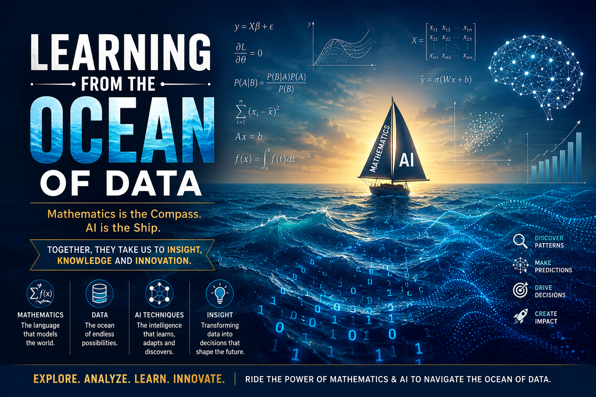

# :classical_building: Learning-from-Ocean-of-Data-Offcource-with-Stories
### Decoded and Simplified Mathematics, Machine Learning and Deep Learning or Artificial Intelligence in General

---

## 👥 Instructor Information
* **Edited By:** [Dr. Mohammed Javed](https://sites.google.com/site/mohammedjaved2016/)
* **Email:** javed@iiita.ac.in
* **PhD Students:** Mr. Apurba Chakraborty (rsi2024005@iiita.ac.in), Ms Aarthi Jha (rsi2025509@iiita.ac.in)

---

## 🎯 Learning Material Objectives and Outcome
To provide a strong mathematical foundation for Information Technology, Artificial Intelligence, Machine Learning, Data Science, and related computing disciplines. The course introduces fundamental concepts of linear algebra, matrix theory, probability, stochastic processes, and optimization-oriented mathematical techniques with emphasis on analytical thinking, modeling, and problem solving for computational applications.

* :o: Understand and apply the principles of linear algebra, matrix operations, vector
spaces, and transformations in computational and IT applications.
* :o: Analyze systems of equations, eigenvalue problems, orthogonality, and matrix
decompositions for data representation and optimization problems.
* :o: Apply probability theory, random variables, distributions, and expectation con-
cepts for uncertainty modeling and data-driven systems.
* :o: Analyze stochastic processes, Markov chains, and random walks, and utilize
mathematical reasoning for AI, machine learning, and information technology applica-
tions

### Prerequisites (if any :thumbsup:, otherwise :x:)
:white_check_mark: Introduction to Programming
:white_check_mark: Basic Mathematics

---

## 📦 Required Materials
1. **Primary Textbook:**
   * 📗 Gilbert Strang, Introduction to Linear Algebra, 6th Edition, Wellesley-Cambridge Press, 2023.
   * 📗 Dimitri P. Bertsekas and John N. Tsitsiklis, Introduction to Probability, 2nd Edition, Athena Scientific, 2008

2.  **Reference Books:**
   * :blue_book: Sheldon Axler, Linear Algebra Done Right, 3rd Edition, Springer, 2015.
   * :blue_book: Athanasios Papoulis and S. Unnikrishna Pillai, Probability, Random Variables and Stochas-tic Processes, 4th Edition, McGraw-Hill Education, 2002.
   * :blue_book: Marc Peter Deisenroth, A. Aldo Faisal and Cheng Soon Ong, Mathematics for MachineLearning, 1st Edition, Cambridge University Press, 2020.
3.  💻**Software:** Access to [GitHub](https://github.com/javedsolutions) and a modern code editor (e.g., [VS Code Editor](https://code.visualstudio.com/Download)). or Use [Google Colab](https://colab.research.google.com/)

---

---

## 🗓️ Course Contents

### 🎯 Unit 1: Linear Algebra and Matrix Theory 🎯

* :large_blue_circle: [Systems of Linear Equations](Unit_1_Linear_Algebra_and_Matrix_Theory/Systems-of-Linear-Equations.md), 

### 🎯 Unit 2: Eigen Analysis and Matrix Decomposition 🎯
* :large_blue_circle: [Eigenvalues and Eigenvectors, Characteristic Equations, Diagonalization of Matrices](Unit_2_Eigen_Analysis_and_Matrix_Decomposition/eigenvalues_eigenvectors_characteristic_equations_diagonalization.md)

### 🎯 Unit 3:  Probability and Random Variables 🎯
* :red_circle: [Events and Probability Spaces](Unit_3_Probability_and_Random_Variables/events_and_probability_spaces.md), :red_circle: [Conditional Probability](Unit_3_Probability_and_Random_Variables/conditional_probability.md), :red_circle: [Bayes’ Theorem, Independence of Events](Unit_3_Probability_and_Random_Variables/bayes_theorem_and_independence.md).

 
### 🎯 Unit 4:  Stochastic Processes and Random Models 🎯
* :red_circle: [Limit Theorems - Law of Large Numbers and Central Limit Theorem](Unit_4_Stochastic_Processes_and_Random_Models/limit_theorems_lln_clt.md). 

---

### 🗺️: Applications and Projects

|💻 |  Applications |Project | Implementation Link |
|:--- | :--- | :---: | :--- |
|1.| Image Compression | SVD-Singular Value Decomposition |  [Python Code](Applications/image_compression.ipynb) |

